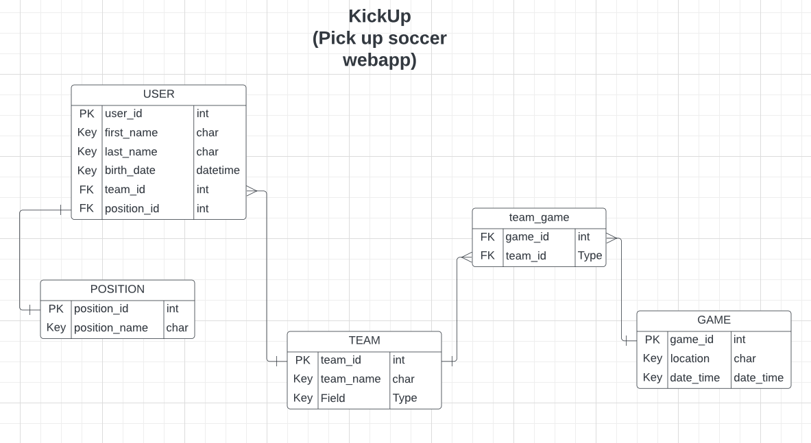

# KickUp

KickUp is a web application that allows users to set up pick up soccer games between different teams with other registered users.

Users are able to sign up and create an account, create and join teams, and set up games. KickUp was created using Flask and SQLAlchemy.

Currently being hosted on Render:
https://kickup-soccer.onrender.com
## Tech Stack/Libraries

**Framework:** Python Flask

## Server Status:


## Entity Relationship Diagram



## Features/Usage

Perform CRUD operations with user account, teams, and games.
- Sign up/Create, update, or delete existing profile.
- Create new team, update, join a registered team, or delete current team.
- Set up, modify, or delete games between registered teams.

Other functionality:
- Users can login with previously created account information.
- Password hashing allows for encrypted and secure passwords.
- Username/Team name validation to ensure unique names are created.
- Teams list displays teams and current roster count.
- Players list displays players and current position.
- Team profiles display current roster list and upcoming game schedule.

## Running the Application
### Running Locally
In the project directory, you can run:

`python3 app.py`

Runs the app in development mode.\
Open [http://localhost:5000](http://localhost:5000) to view it in your browser.

From the project root directory, you can seed the database with mock data by running:

`python3 -m kickup_app.data.seed`

This will populate the database with 100 players and 5 different teams. Players will have a `team_id` linking them to one of the 5 seeded teams.

### Running via Docker
To run in a Docker container, run the command:

`docker compose up --build`

This will generate containers for both the application and the database.

## Running Tests

To run tests, run the following command:

```bash
  python3 -m unittest discover
```

## Future Iterations

- Styling to provide a more friendly user interface and user experience.
- Utilize a map/location API to set up geographically accurate game locations.
- Implement functionality to allow users to RSVP for upcoming games.
